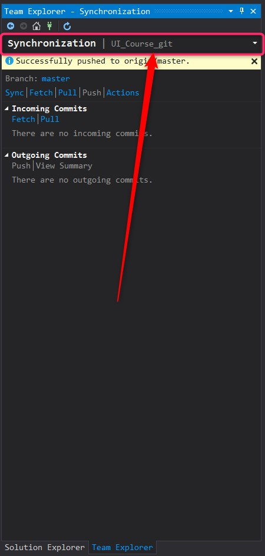

# Uploading your code to GitHub 

### Intro

Git is a convenient way to store your code. By default, nothing except code should go there. 
Git is not designed to handle large files, i.e. anything except text files with code. 
You will sometimes need to store test data there, though this is not recommended. 
What definitely should never be in Git are .dll, .exe and similar compiled code files (e.g. those in packages folder).

There is a special thing called Git Large File Storage that can be used, but it's a questionable practice.

Git can be complicated (but it is truly an amazing solution for shared code and text storage), and I encourage you to read about it. 
You can work with Git from a console, however Visual Studio’s Team Explorer is a lot simpler and provides all the basics that you need.
You can find a basic flow that will let you store your code in GitHub and update it using Team Explorer below.

### Steps for GitHub (they are similar for any Git)

1.	Create your repository and a new project on GitHub (github.com, register, etc.);
2.	Open your project and copy its Clone link (Clone button is always somewhere on the main page of a repository in any Git);
3.	On your Visual Studio starting screen, select TeamExplorer->Clone, then paste the Clone link and select local folder where your code will be;
4.	After the new project opens in VS, copy your code (the entire solution folder, .sln file must be present) into the specified local folder (using Windows Explorer), right next to the .git folder;
5.	In Visual Studio, in Team Explorer, select Changes in the dropdown (see screenshot). Remember this dropdown, it’s important and easy to miss:

6.	Select .vs, packages, bin, debug folders. Right-click and select “ignore these local files”. This will add these folders to .gitignore and you will not push them to Git. 
Remember, that these folders contain compiled code and other stuff that is generated based on your code text files (and can always be easily re-generated). Do not push this trash to Git;
7.	Add a message to your commit (best practice is to keep your commits small with descriptive messages). Then right-click Commit All and select Commit All and Push;
8.	Enter your GitHub credentials and done! If you update your code and want to push it to GitHub, simply navigate to Team Explorer -> Changes, review the change list, and add a message and do Commit All and Push again.
